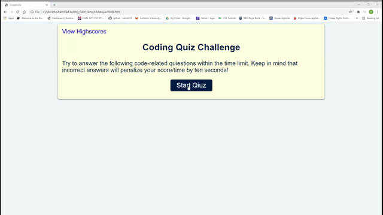

# CodeQuiz
04 Web APIs: Code Quiz - Assignment

This is a timed JavaScript fundamentals coding quiz with multiple-choice questions.
 This app will run in the browser.
 It has a responsive user interface for small screens.

 ## Criteria

 ```
GIVEN a user is taking a code quiz
WHEN the click the Start Quiz button
THEN a timer starts and the user is presented with a question
WHEN the user answer a question
THEN the user is presented with another question
WHEN the user answer a question incorrectly
THEN time is subtracted from the clock
WHEN all questions are answered or the timer reaches 0
THEN the game is over
WHEN the game is over
THEN the user can save his/her initials and score
```

## Mock-Up

The following animation demonstrates the application functionality:




* The URL of the deployed application: https://zahid267.github.io/CodeQuiz/

* The URL of the GitHub repository: https://github.com/zahid267/CodeQuiz
